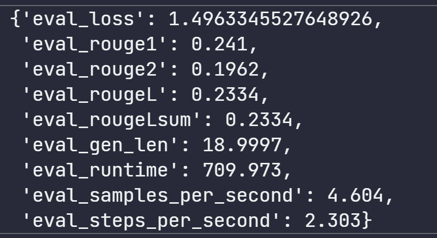
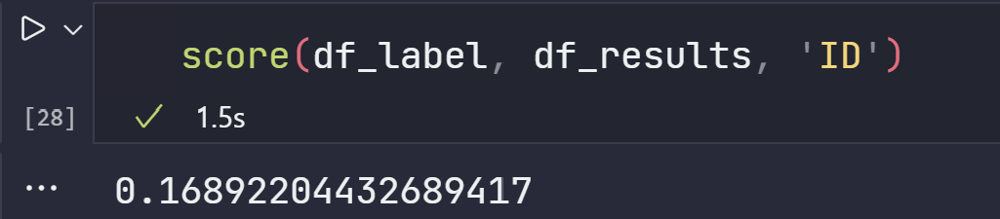
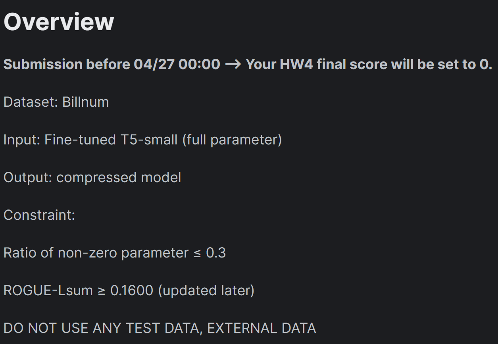
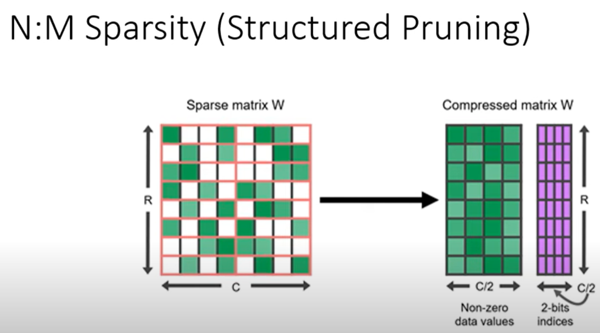
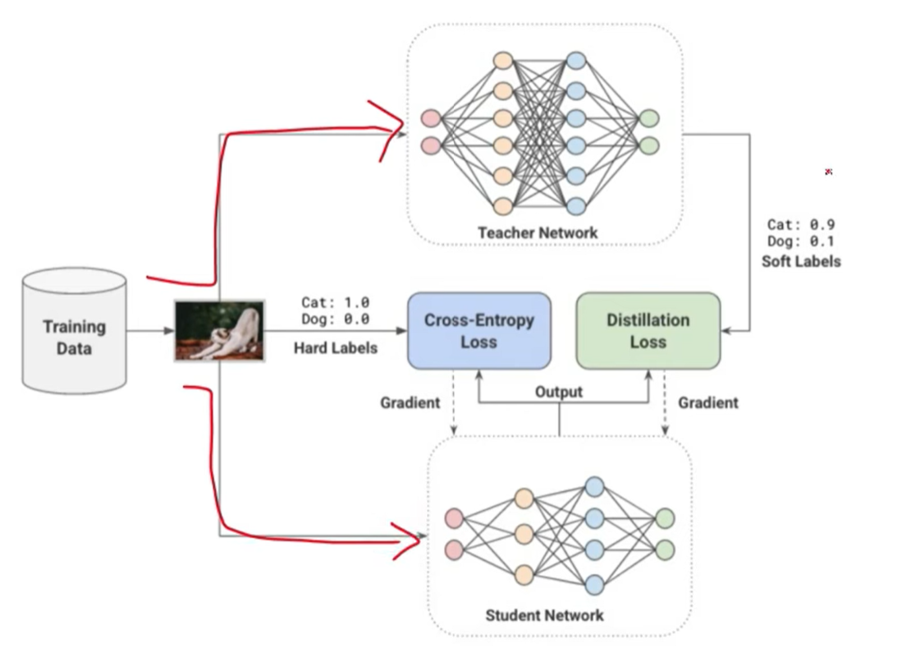

# Note

## Written By KYLiN

---

Using datasets : [billsum](https://github.com/tensorflow/datasets/blob/master/docs/catalog/billsum.md)

Full Model Source :

Full Model in TA ROUGE-Lsum : 

Kaggle Baseline : 

---

## Pruning Model

Video : [NLP pruning](<https://www.youtube.com/watch?v=UcwDgsMgTu4>)

Torch Pruning : [Pruning](https://pytorch.org/tutorials/intermediate/pruning_tutorial.html)

1. Structured Pruning

2. Knowledge Distillation

